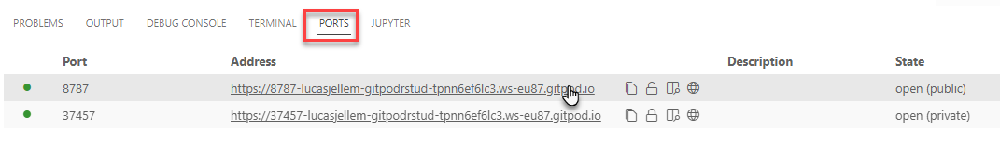
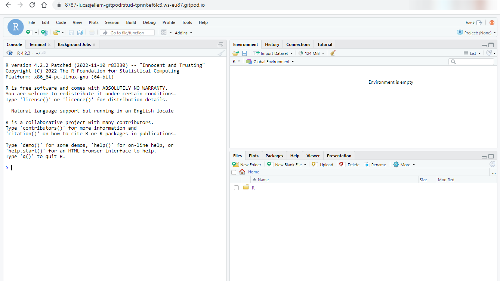

# Gitpod environment for working with RStudio Server

[](https://gitpod.io/#https://github.com/lucasjellema/gitpod-rstudio)

Once the Gitpod workspace is launched, you will need to wait for a few minutes while the workspace is prepared. Packages are updated, new files are downloaded and the RStudio server is installed and started. You can check the first terminal window to see what is going on - and find out when the actions are complete. Note: the actions that are performed are defined in the file `.gitpod.yml`.

When the actions are done, you will see a message in the terminal that invites you to complete the creation of a new user - randomly called *hank*  (feel free to create a different user account). You will connect in the browser to the RStudio client using this Linux user and password.

After creating the user, you can open the RStudio GUI in the browser. From the Ports tab open the URL listed for port 8787. 
  
RStudio launches in a new browser tab. Login with username *hank* and their password.

Note: RStudio client "remembers" passwords - and it seems somewhat sensitive to wrong logins. You may need to try opening the URL in an incognito browser window and/or a different brower from the one in which you are accessing the Gitpod. (I have been struggling a little bit with that).

Once the login is successful, you will the RStudio client in your browser like this:
  

and you can start your investigations.

## How the environment is built

I have worked using various resources, of which the most important was: https://www.drdataking.com/post/rstudio-server-on-ubuntu-through-windows-subsystem-for-linux-wsl2/

Taking my lead from this article and considering that the base image for Gitpod at present is Ubuntu 20.04 LTS, I have create a `.gitpod.yml` file with the following steps:

These commands to upgrade Ubuntu packages

```
sudo apt-get update
sudo apt-get upgrade -y
```

To add credentials to your repository list for Getting the Latest R

```
sudo apt-key adv --keyserver keyserver.ubuntu.com --recv-keys E298A3A825C0D65DFD57CBB651716619E084DAB9
sudo add-apt-repository 'deb https://cloud.r-project.org/bin/linux/ubuntu focal-cran40/'
```

This next command to install the most recent R and some necessary dependencies
```
sudo apt install -y r-base r-base-core r-recommended r-base-dev gdebi-core build-essential libcurl4-gnutls-dev libxml2-dev libssl-dev
```

Make default port 8787 public (this command is equivalent to the `ports: - port: 8787 visibility: public` definition in the .gitpod.yml file):
```
gp ports visibility 8787:public
```

Download and install RStudio Server using the following commands
```
wget https://rstudio.org/download/latest/stable/server/bionic/rstudio-server-latest-amd64.deb
sudo gdebi --n rstudio-server-latest-amd64.deb
```

Launch the RStudio Server (this probably already has happened automatically as part of the gdebi installation)
```
sudo rstudio-server start
```

Add user (for RStudio) hank with passaord hank (feel free to change as desired)

```
sudo adduser hank
```

Define a password for hank and confirm it. Accept default information. 

Open RStudio - from the Ports tab open the URL listed for port 8787. RStudio launches in a new browser window. Login with username *hank* and their password.

Note: RStudio client "remembers" password - and it seems somewhat sensitive to wrong login. You may need to try an incognito browser window and/or a different brower from the one in which you are accessing the gitpod.  

## Note: Remove/Uninstall

If you want to stop and remove/uninstall the server, you may do the following:

```
# To stop the server
sudo rstudio-server stop

# To remove the server
sudo apt-get remove rstudio-server -y
``` 

## Resources

the most important article I used :RStudio Server on Ubuntu through Windows Subsystem for Linux (WSL2) -  https://www.drdataking.com/post/rstudio-server-on-ubuntu-through-windows-subsystem-for-linux-wsl2/

other resources:

* How to install RStudio Server open source on Ubuntu 20.04 LTS - https://www.how2shout.com/linux/install-rstudio-server-open-source-on-ubuntu-20-04-lts/
* Download RStudio Server - https://posit.co/download/rstudio-server/
* Getting Started with Posit Workbench / RStudio Server - https://support.posit.co/hc/en-us/articles/234653607-Getting-Started-with-Posit-Workbench-RStudio-Server
